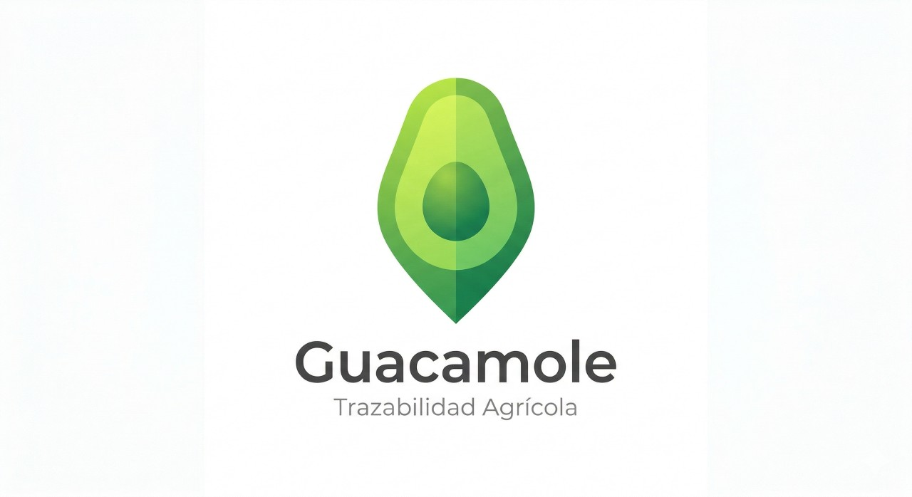

# Guacamole
<div align="center">
  
</div>

> **Blockchain-powered agricultural supply chain traceability** — From farm to table with complete transparency

[](https://reactjs.org/)
[](https://vitejs.dev/)
[](https://tailwindcss.com/)
[](https://stellar.org/)
[](LICENSE)

---

## Description

**Guacamole** is a web-based agricultural traceability platform that uses blockchain (Stellar/Soroban) to guarantee complete transparency in the supply chain. Each product is registered as a verifiable NFT, allowing producers, intermediaries, and consumers to track the complete journey from farm to table.

### Why Guacamole?

Guacamole is made from verifiable natural ingredients, each with its own origin. Just like guacamole, our system verifies the origin of each ingredient (agricultural product) through the supply chain.

---

## Main Features

### 3 User Profiles

#### Producer — Verified Origin

- Register your orchard with photo + GPS geolocation
- Create harvest batches with photographic documentation
- Generate unique NFTs for each batch (QR code included)
- Access dashboard with harvest history
- **Flow**: `Register Orchard` → `Dashboard` → `Capture Harvest`

#### Intermediary — Transit Verification

- Scan QR codes of received batches
- Record quality metrics (Brix, temperature, destination)
- Digitally sign receipt on blockchain
- Create immutable inspection audit
- **Flow**: Scan QR → Enter quality data → Confirm receipt

#### Consumer — Complete Transparency

- Scan QR on product to see complete traceability
- Visualize timeline of **Origin** → **Harvest** → **Delivery**
- Verify authenticity on blockchain
- Public access without authentication
- **Flow**: `Scan QR` → View traceability timeline

---

## Quick Start

### Prerequisites

- Node.js 18+
- npm 9+
- Camera access (for photo capture and QR scanning)

### Installation

```bash
# Clone repository
git clone <repo-url>
cd Project

# Install dependencies
npm install

# Start development server
npm run dev
```

The server will start at `http://localhost:5173`

### Build for Production

```bash
npm run build
```

Compiled files will be in `dist/`

---

## Application Routes

| Route                       | Description                       | Access             |
| --------------------------- | --------------------------------- | ------------------ |
| `/`                         | Landing page with value proposal  | Public             |
| `/trace/:loteId`            | Public traceability view          | Public (Consumer)  |
| `/app`                      | Authenticated app (main hub)      | Producers          |
| `/app/register-orchard`     | Initial orchard registration      | Producer (first-time) |
| `/app/dashboard`            | Dashboard with registered batches | Producer           |
| `/app/capture-batch`        | Create new harvest/batch          | Producer           |
| `/app/qr-scanner`           | Scan batch QR codes               | Intermediary       |
| `/app/traceability/:loteId` | Complete batch history            | Producer/Demo      |

---

## Architecture

### Technology Stack

```
Frontend:
├─ React 19.2 (UI Framework)
├─ React Router 7 (Navigation)
├─ Vite 8 (Build tool + HMR)
├─ Tailwind CSS 4.2 (Styling)
└─ Lucide React (Icons)

Features:
├─ QR Code Gen/Scan (qrcode.react, html5-qrcode)
├─ EXIF Extraction (piexifjs) → GPS from photos
├─ Geolocation (Browser API)
└─ Blockchain (Stellar - simulated in demo)

State:
├─ React Context (AppContext, ToastContext)
└─ localStorage persistence (guacamole-state)
```

### Folder Structure

```
src/
├── components/
│   ├── common/
│   │   ├── Button.jsx          # Reusable button component
│   │   ├── Card.jsx            # Surface container
│   │   ├── Badge.jsx           # Status badges
│   │   ├── Modal.jsx           # Dialog windows
│   │   ├── CameraCapture.jsx   # Photo input with EXIF
│   │   ├── Timeline.jsx        # Batch journey visualization
│   │   ├── Spinner.jsx         # Loading indicator
│   │   ├── Toast.jsx           # Notifications
│   │   └── GuacamoleLogo.jsx   # Brand logo component
│   ├── landing/
│   │   └── LandingPage.jsx     # Public homepage
│   └── screens/
│       ├── RegisterOrchard.jsx   # Orchard signup (Step 1)
│       ├── ProducerDashboard.jsx # Producer hub
│       ├── CaptureBatch.jsx      # Create new batch NFT
│       ├── QRScanner.jsx         # Intermediary verification
│       └── TraceabilityView.jsx  # Public timeline view
├── context/
│   ├── AppContext.jsx          # Global state management
│   └── ToastContext.jsx        # Notification system
├── hooks/
│   └── useGeolocation.js       # Browser geolocation wrapper
├── utils/
│   ├── blockchain.js           # Stellar integration
│   └── exifExtractor.js        # GPS from photo metadata
├── pages/
│   └── AppLayout.jsx           # Main app wrapper
├── App.jsx                     # Router & routes
├── main.jsx                    # Entry point
└── index.css                   # Global styles

assets/
├── hero.jpg                    # Hero background
├── productor.jpg               # Profile image
├── intermediario.jpg           # Profile image
├── consumidor.jpg              # Profile image
├── favicon.svg                 # Guacamole icon
└── react.svg / vite.svg        # Build tool logos
```

### State Flow (AppContext)

```javascript
State {
  orchard: {
    id, name, owner, lat, lng,
    photoUrl, txHash, timestamp
  },
  lotes: [
    {
      id, orchardId, photoUrl, lat, lng, weight,
      status: "Cosechado" | "Entregado",
      txHash, photoHash, qrData,
      reception: { brix, temperature, destination, txHash } | null
    }
  ]
}

Actions:
- REGISTER_ORCHARD: initialOrchardData
- ADD_LOTE: newLoteData
- UPDATE_LOTE_STATUS: { loteId, status }
- CONFIRM_RECEPTION: { loteId, receptionData }
- CLEAR_SESSION: logout
```

---

## Main Features

### Orchard Registration (Producer)

1. **Photo Capture**
   - Real-time camera access
   - Automatic EXIF metadata preservation
   - Option to retake photo

2. **Geolocation**
   - Attempts to extract GPS from EXIF (if camera has GPS)
   - Automatic fallback to Browser Geolocation API
   - Works on HTTP localhost (no HTTPS required)
   - Displays coordinates with 6 decimal precision

3. **Orchard Data**
   - Orchard name
   - Owner name
   - NFT minting on blockchain (verifiable)

### Harvest Capture (Producer)

1. **Photographic Documentation**
   - Capture batch photo
   - Automatic GPS extraction
   - Visual validation

2. **Weight & NFT Generation**
   - Enter weight in kg (required > 0)
   - Generate unique ID: `LOTE-[TIMESTAMP_BASE36]-[RANDOM]`
   - Create SHA-256 photo hash (integrity verification)
   - Mint on blockchain (returns txHash)

3. **QR Code**
   - QR automatically generated with batch data
   - Scannable by intermediaries and consumers
   - Embedded data: batchId, txHash

### QR Scanning (Intermediary)

1. **QR Capture**
   - HTML5 scanner with auto-focus
   - Support for manual ID search
   - Fallback for incompatible cameras

2. **Quality Verification**
   - Brix score (maturity/sugar content measure)
   - Recorded temperature (°C)
   - Final destination (point of sale)

3. **Digital Signature**
   - Record reception on blockchain
   - Mark batch as "Delivered"
   - Generate verification txHash

### Traceability Timeline (Consumer)

**3-stage visualization:**

| Stage    | Data Shown                             | Verification      |
| -------- | -------------------------------------- | ------------------ |
| Origin   | Orchard photo, name, owner, GPS        | blockchain txHash  |
| Harvest  | Batch photo, weight, GPS, ID, status   | Photo hash         |
| Delivery | Brix, temperature, destination, date   | receipt txHash     |

Public access without authentication. Demo: `/trace/demo`

---

## Design & UX

### Color Palette

```
Primary:        #16a34a (Green - Growth/Nature)
Primary Dark:   #15803d (Hover states)
Accent:         #ca8a04 (Gold - Premium)
Background:     #f8fafc (Light slate)
Surface:        #ffffff (White cards)
```

### Reusable Components

- **Button**: 5 variants (primary, secondary, outline, danger, ghost) × 3 sizes (sm, md, lg)
- **Card**: Flexible surface with optional onClick
- **Badge**: Color-coded status badges (Harvested, Delivered, etc.)
- **Modal**: Reusable dialog with backdrop
- **Timeline**: Vertical visualization with verified nodes
- **Spinner**: Loading indicator with optional text
- **Toast**: Auto-dismiss notification system

---

## Blockchain Integration (Stellar)

### Contracts/Functions (Demo)

```javascript
// utils/blockchain.js

mintToBlockchain(data)
  → Inputs: { type, name, owner, lat, lng, ... }
  → Returns: { txHash, timestamp, data }
  → Simulates 2s transaction in demo

generateHash(input)
  → SHA-256 digest
  → Used for photo integrity verification

generateLoteId()
  → Creates unique ID: LOTE-[TIMESTAMP_BASE36]-[RANDOM_4]
  → Guarantees uniqueness + readability
```

**Current Status**: Mock/simulated for demonstration. Ready for real Stellar SDK integration.

---

## Data Persistence

- **Method**: localStorage with key `guacamole-state`
- **Content**: Orchard + all batches (complete state)
- **Auto-sync**: Automatically updates on each change
- **Duration**: Persists between browser sessions
- **Reset**: `CLEAR_SESSION` function empties everything

---

## Use Cases

### **Producer Flow**

```
1. Landing → Click "Try Demo" → Profile modal
2. Select "Producer" → /app/register-orchard
3. Capture photo + allow GPS → Fill form → Register
4. Navigate to Dashboard → See orchard + empty (no batches)
5. Click + FAB → /app/capture-batch
6. Capture photo → Enter weight → Generate NFT
7. See modal with QR → Back to dashboard
8. New batch appears with timestamp
```

### **Intermediary Flow**

```
1. Landing → Click "Try Demo" → Select "Intermediary"
2. Navigate to /app/qr-scanner
3. Scan QR or Search by ID
4. Fill quality form: Brix, Temperature, Destination
5. Confirm Reception → Blockchain
```

### **Consumer Flow**

```
1. Landing → Click "Try Demo" → Select "Consumer"
2. Navigate to /trace/demo
3. Timeline shows 3 stages
4. Verify TX hashes on blockchain
```

---

## Key Dependencies

| Package            | Version | Use            |
| ------------------ | ------- | -------------- |
| `react`            | 19.2.4  | UI framework   |
| `react-router-dom` | 7.x     | Routing        |
| `vite`             | 8.0     | Build tool     |
| `tailwindcss`      | 4.2.2   | Styling        |
| `qrcode.react`     | ^1.0    | QR generation  |
| `html5-qrcode`     | ^2.3    | QR scanning    |
| `piexifjs`         | ^0.1    | EXIF metadata  |
| `lucide-react`     | ^0.x    | Icons          |

---

## Complete Quick Start

```bash
# 1. Installation
npm install

# 2. Development
npm run dev              # http://localhost:5173

# 3. Testing
- Landing page: /
- Producer demo: Click "Try Demo" → "Producer"
- Intermediary: Select "Intermediary" 
- Consumer: Select "Consumer"

# 4. Build
npm run build

# 5. Preview
npm run preview
```

---

## License

MIT © 2026 Mx Alebrijes

---

## Contact & Support

- **Value Proposal**: Blockchain for 100% transparent agricultural traceability
- **Powered by**: Stellar & Soroban
- **Built with**: React + Vite + Tailwind CSS

---

<div align="center">

### Guacamole — Verifiable Agricultural Traceability

**From farm to your table, with peace of mind.**

</div>
